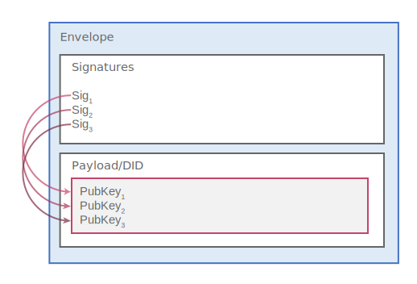

Methods
-------

### Read

`GET {did}`

### Create `PUT {did}`

```json
{
  "action": "create",
  "did": {
    "@context": "https://w3id.org/did/v1",
    "id": "did:corda:tcn:00000000-0000-0000-0000-000000000000",
    "publicKey": [
      {
        "id": "did:corda:tcn:00000000-0000-0000-0000-000000000000#keys-1",
        "type": "Ed25519",
        "controller": "did:example:00000000-0000-0000-0000-000000000000",
        "publicKeyBase58": "GfHq2tTVk9z4eXgyP8um5eg46am2W7LiuDyxW1kk5wy3tRWDg8HNn6UeEUnK"
      }
    ]
  }
}
```

#### Payload:

Any payload that creates or modifies a DID document will have to contain _proof of ownership_ with it.
To implement that, any DID document must be be wrapped in an envelope.
This envelope must contain signatures by all private keys associated with the public keys contained in the documents.



Envelopes that do not contain signatures for all public keys will be rejected.
Envelopes using unsupported cryptographic suites or unsupported serialisation mechanisms will be rejected.

Caveats
-------

 - Cypher Suites supported as per https://w3c-ccg.github.io/did-spec/#registries
 - Mechanisms supported, i.e. publicKeyPem, publicKeyJwk, publicKeyHex, publicKeyBase64, publicKeyBase58, publicKeyMultibase


Currently, only cryptographic suites as per the [Linked Data Cryptographic Suite Registry](https://w3c-ccg.github.io/ld-cryptosuite-registry) (Draft Community Group Report 09 December 2018) are tested as public keys in DID documents in their default serialisations.

| Cryptographic Suite         | Representation        |
|-----------------------------|-----------------------|
| `Ed25519Signature2018`      | Base 58               |
| `RsaSignature2018`          | PEM                   |
| `EdDsaSASignatureSecp256k1` | Lowercase Hexadecimal |

Future implementations should be representation-agnostic.

